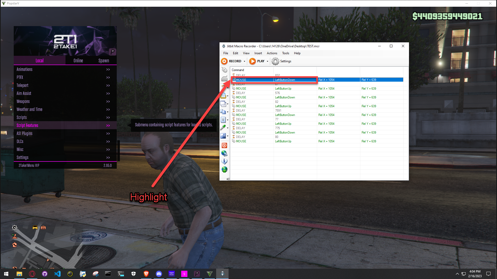
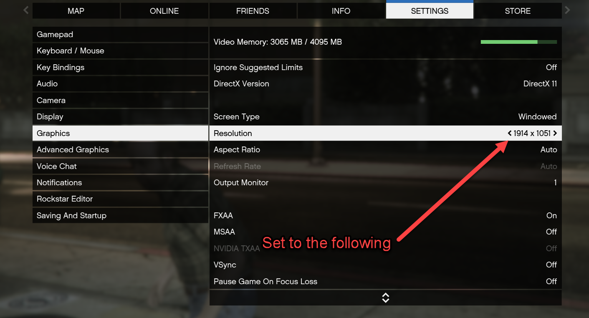
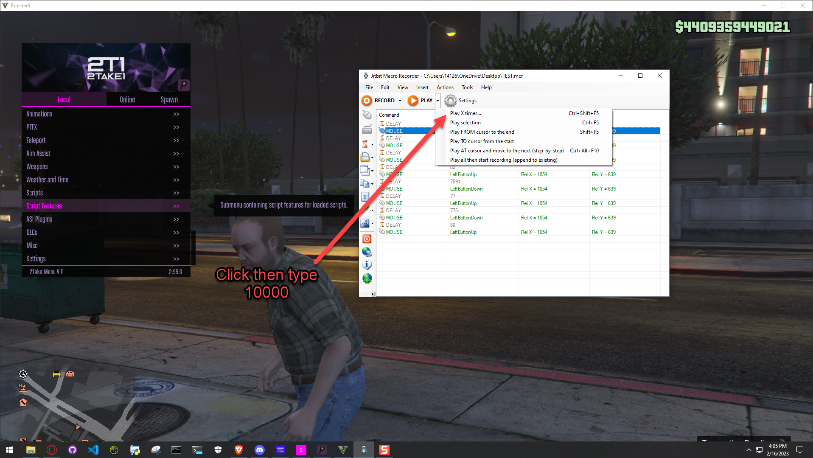

# Bunker Automation Macro
Automation script for 2T1 Master Unlocker The Bunker Version

## Program Used
- Jitbit Macro Recorder

## Paid Version
Jitbit Macro Recorder: [Click Here](https://www.jitbit.com/macro-recorder/purchase/) 

## Cracked Version
Cracked Jitbit Macro Recorder: [Click Here](https://getintopc.com/softwares/utilities/jitbit-macro-recorder-free-download-1747480/) 

## Step 1:
- Install Jitbit Macro
- Open Jibit Macro Recorder

### Step 2: 
- File Open BunkerAutomation.mcr
- Highlight
#

#
### Step 3:
- Then proceed to enable the following in Game settings.
#

#
### Step 4:
- Then enable the following settings for master unlocker.
#

#

### Step 5: 
- Enter: 10000 times This will make it so it loops 10k times.
#

#

### Step 5: 
Find the <b>"Sell Stock"</b> Box in the Bunker Manager app and take note of the Window Position 

<b>This can be any RED Pixel. (505, 632 By Default)</b> 
